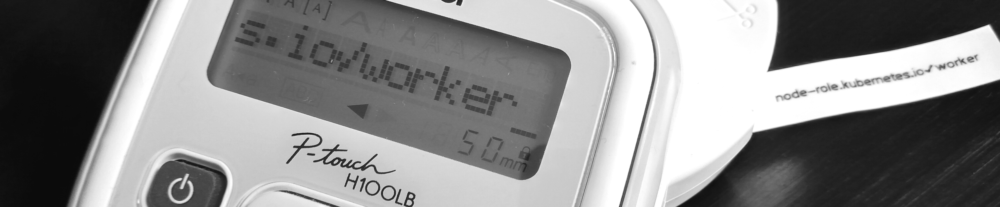

# *Label-Maker*

## TL;DR
The *Label Maker* is a small *Kubernetes* controller that watches cluster nodes. It picks up the intended role of a node from a configurable role label and sets that role in a `node-role.kubernetes.io/{role}` label.

## Background
The `kubelet` allows to set node labels via the command line argument `--node-labels`. Starting with *Kubernetes 1.16*, it is for security reasons no longer allowed to set a node label of the form `node-role.kubernetes.io/{role}` for the role of the node the `kubelet` is running on ([details](https://github.com/kubernetes/enhancements/blob/master/keps/sig-architecture/2019-07-16-node-role-label-use.md)). In the setup I'm working with, we create two types of cluster nodes -`worker` and `infra`- via autoscaling groups. In the `cloud-init` scripts of the nodes, we add `--node-labels` to the extra arguments of the `kublet`, and it contains `node-role.kubernetes.io/{role}` with the intended role. This no longer works and breaks a few things for us.

## Solution
Once a node has joined the cluster, it's possible to set a `node-role.kubernetes.io/{role}` label via the API to anything you like, sufficient permissions provided. Now we could add an according `kubectl` command to the `cloud-init` script of the nodes. But that would require that we also provide a `kubeconfig` for API access there, which we don't want on those nodes. The idea for *Label Maker* was to set the node role in a different label and then have a controller copy that into a `node-role.kubernetes.io/{role}` label. That's really all that `label-maker` is doing.

## Usage
The default for the node role label is `node.kubernetes.io/role`. It can be set via environment variable `ROLE_LABEL`. When the controller reconciles a node, it will check whether it already has any label of the form `node-role.kubernetes.io/*` set. If so, it does nothing for that node. Otherwise, if the role label is set, e.g. `node.kubernetes.io/role=worker`, it's value is added as a `node-role.kubernetes.io/{role}` label. For our example that would be `node-role.kubernetes.io/worker=`. Note that with this behavior, a later update to the role label would not update `node-role.kubernetes.io`. For this, it would have to be removed first.

## Deploying
There's an example manifest under `deploy`. A *Docker* image is hosted on *DockerHub*.

## Developing
Even though *Label-Maker* isn't using any custom resources, and it's not truly an operator, it's built with the [*Operator-SDK*](https://github.com/operator-framework/operator-sdk). That's mostly for convenience. The `Makefile` has targets for building the binary and *Docker* image, and other stuff. Just run `make` to get a list. Note that for consistency, building is done inside a development container, so you will need *Docker* to build. The required development image is built the first time you invoke any of the build targets.
